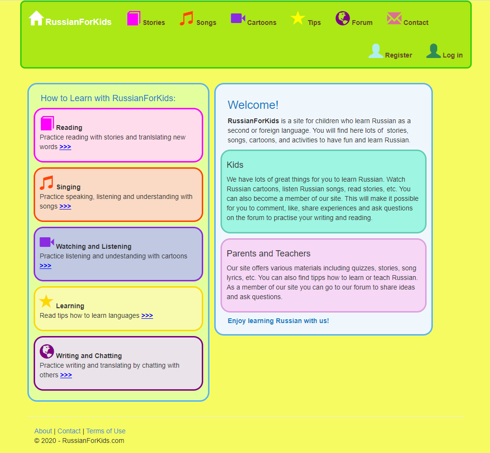
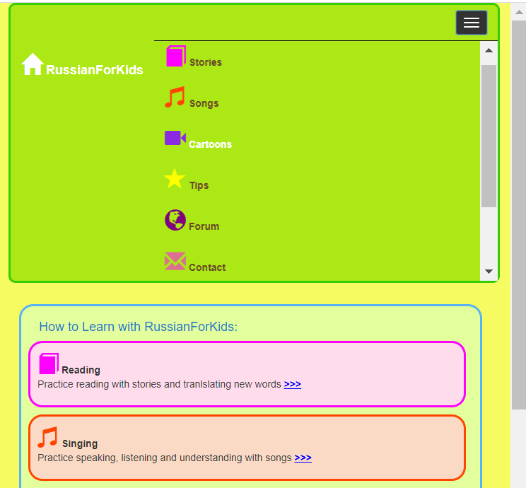
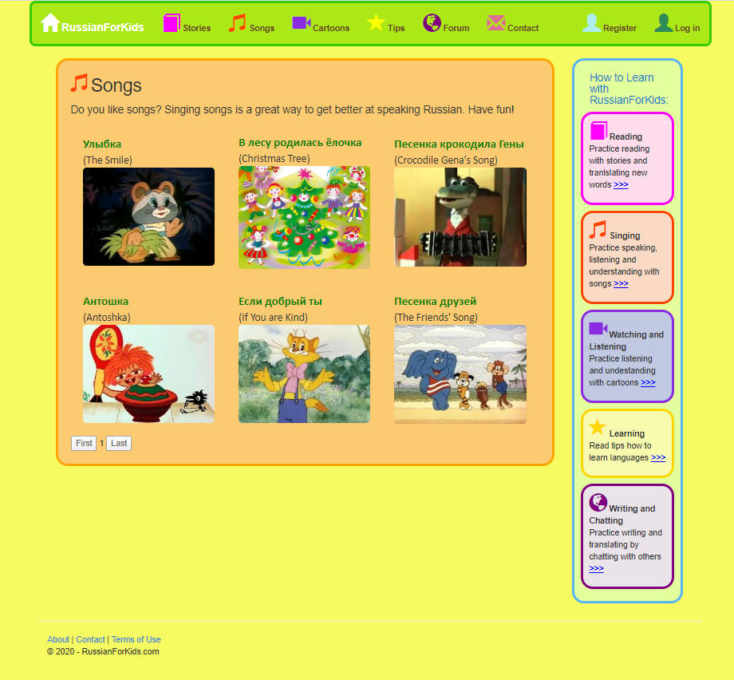
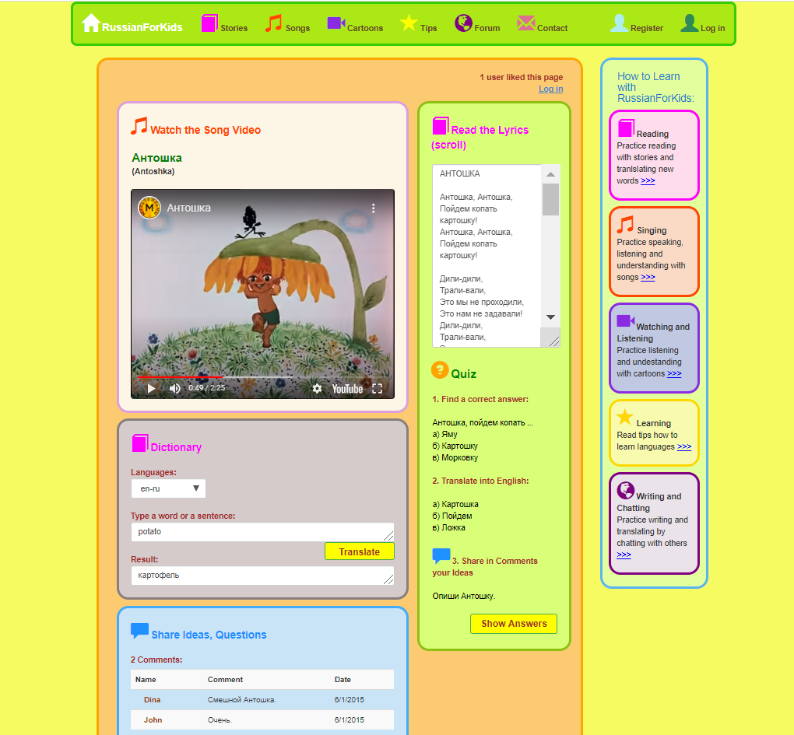
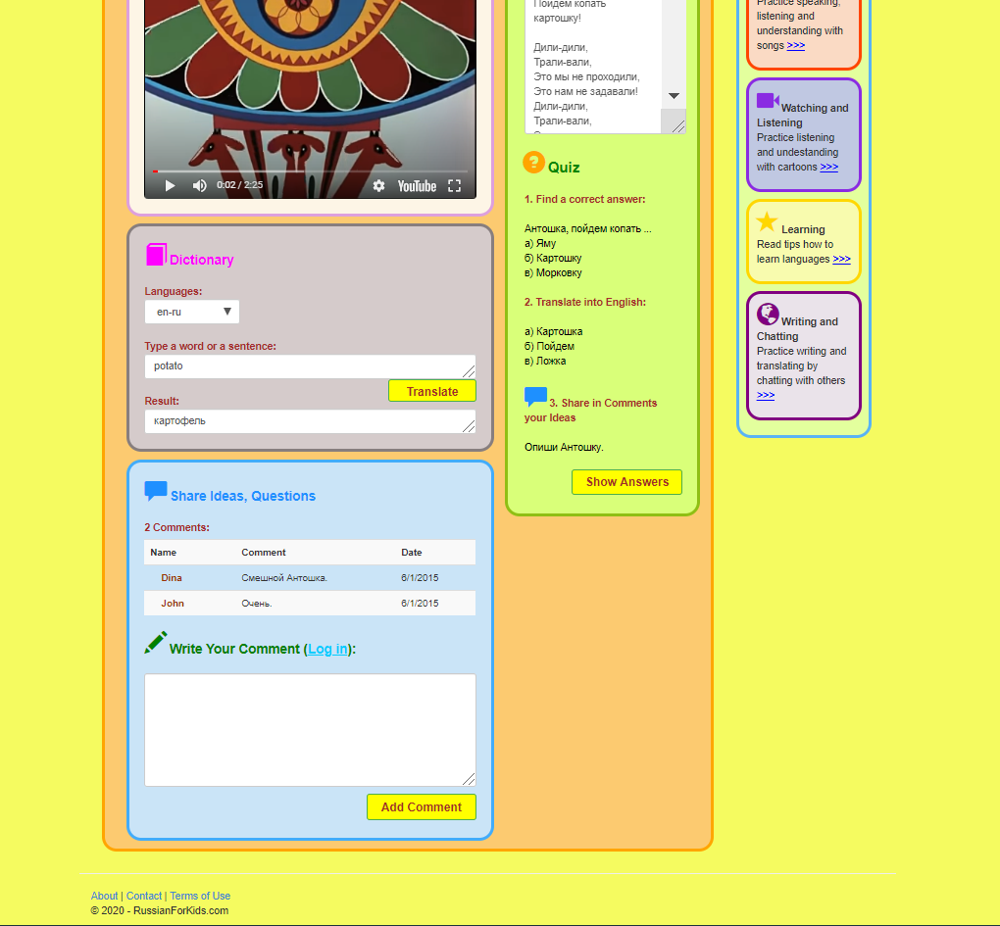

# RussianForKids
Project: Web application for children to learn Russian as a foreign language

<h4>Description</h4>
                            
The project "RussianForKids" was a MS course project with the aim to design and develop a web application for children to learn Russian as a foreign language following the guidelines on design principles for children as well as on language learning.

                            <h4>Developing Tools:</h4>
                            <ul>
                                <li>HTML</li>
                                <li>CSS</li>
                                <li>Bootstrap</li> 
                                <li>ASP.NET</li> 
                                <li>Visual Basic</li> 
                                <li>Javascript</li>
                                <li>Yandex.Translate API</li>
                                <li>Youtube IFrame Player API</li>
                            </ul>
                            <h4>Features:</h4>
                            <ul>
                                <li>The webstite is created using ASP.NET, Visual Basic for the server-side code, Bootstrap for styling, ACCESS for data storing, SQL for accessing the data, Yandex.Translate API for translation services and Youtube IFrame Player API for video content.</li>
                                <li>The homepage of RussianForKids provides the user with information about the ways to learn Russian and interact with the application.</li>
                                <li>The navigation bar displays the different activities offered and lets the user to navigate to a desired section (stories, songs, cartoons, etc.).</li>
                                <li>For consistency and an easy access to the alternative activities, the information is presented in the same format and look on all pages. All the instructions are given using both illustrative icons and text.</li>                     
                                <li>RussianForKids offers various activities to make it more enjoyable to use the application: watch a video, listen to a song, read a story, translate using the embedded dictionary, take a quiz, or write a comment.</li>
                                <li>To make RussianForKids more interactive the user can sign up to like, comment, or post information. Only registered users can do these tasks but all users can see the number of likes, and read the comments and posts.</li>
                            </ul>

.............................................................

.............................................................

